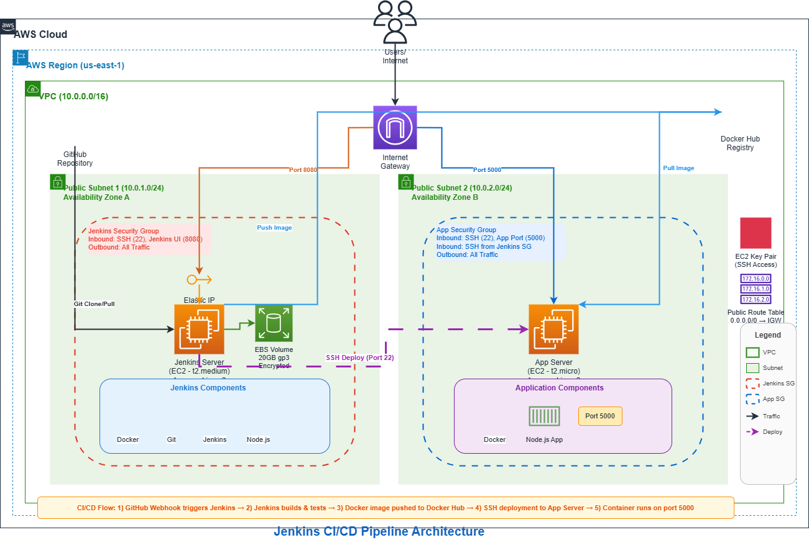
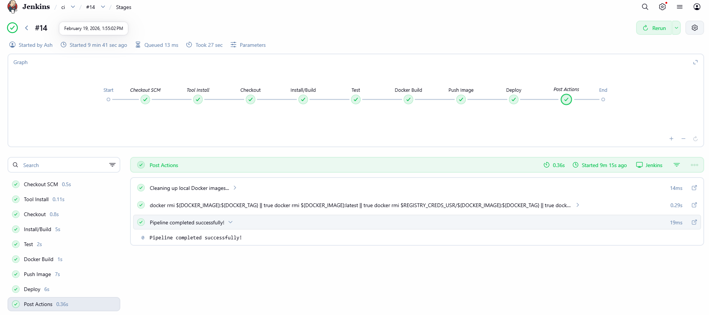
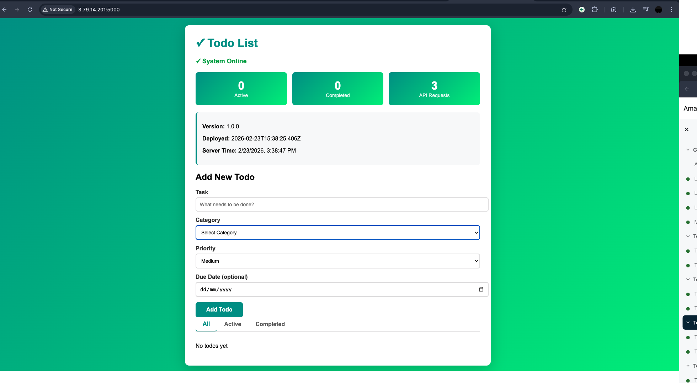

# Complete CI/CD Pipeline with Jenkins

Automated CI/CD pipeline that provisions AWS infrastructure with Terraform, runs Jenkins in Docker on EC2, and deploys a containerized Node.js application via SSH.

## Architecture




```
Developer  →  GitHub  →  Jenkins (EC2 · Docker)  →  Docker Hub  →  App Server (EC2)
Observability: App → OTLP → Jaeger | App → /metrics → Prometheus → Grafana
```
  1. Checkout                 – clone repo
  2. Install                  – npm ci
  3. Test                     – npm test (Jest)
  4. Security Scan - Dependencies – npm audit for vulnerabilities
  5. Docker Build             – build & tag image
  6. Security Scan - Image    – Trivy container vulnerability scan
  7. Push Image               – push to Docker Hub
  8. Deploy                   – SSH into app server, pull & run container
```

**AWS resources created by Terraform:**

| Resource        | Purpose                    |
| --------------- | -------------------------- |
| VPC + subnets   | Network isolation          |
| Security groups | Restrict access to your IP |
| EC2 `t3.micro`  | Jenkins server (Docker)    |
| EC2 `t3.micro`  | Application server         |
| Key pair        | Auto-generated SSH keys    |

## Security Features

This pipeline implements comprehensive security best practices across all layers:

### Application Security

- **Helmet.js**: Security headers including HSTS, CSP, X-Frame-Options
- **Rate Limiting**: 100 requests/15min (general), 20 requests/15min (write operations)
- **Request Size Limits**: 10KB max for JSON/URL-encoded bodies
- **CORS**: Environment-based origin control with configurable allowed origins
- **Input Validation**: express-validator on all API endpoints
- **XSS Protection**: Automatic input sanitization
- **Parameter Validation**: Type checking and range validation on all inputs

### Container Security

- **Non-root User**: Container runs as `nodejs` user (UID 1001)
- **Health Checks**: Built-in container health monitoring
- **Minimal Attack Surface**: npm cache cleaned, production-only dependencies
- **Vulnerability Scanning**: Trivy scans for HIGH/CRITICAL vulnerabilities in CI/CD

### Infrastructure Security

- **IMDSv2 Enforcement**: Prevents SSRF attacks on EC2 metadata service
- **Encrypted EBS Volumes**: All root volumes encrypted at rest
- **Restricted Security Groups**: SSH access limited to `allowed_ips`, no 0.0.0.0/0
- **VPC Isolation**: Private subnets available, network segmentation
- **Security Group Rules**: Separate rules prevent circular dependencies

### CI/CD Security

- **Credential Protection**: No credentials exposed in logs (`set +x`, filtered output)
- **SSH Key Verification**: `StrictHostKeyChecking=accept-new` instead of `no`
- **Dependency Scanning**: npm audit runs on every build
- **Image Scanning**: Trivy container vulnerability scanning
- **Secret Management**: AWS Secrets Manager for Jenkins credentials
- **Reduced Logging**: Minimal verbose output to prevent information leakage

### Environment Variables

Set these for production deployments:

```bash
export ALLOWED_ORIGINS="https://yourdomain.com,https://app.yourdomain.com"
export APP_VERSION="1.0.0"
```

## Prerequisites

- **AWS CLI** configured (`aws configure`)
- **Terraform** >= 1.0
- **Docker Hub** account
- **GitHub** repository with this code
- Your public IP — run `curl ifconfig.me`

## Quick Start

### 1. Install Dependencies

```bash
npm install
```

This installs security packages:

- `helmet` - Security headers
- `express-rate-limit` - Rate limiting
- `express-validator` - Input validation
- `cors` - Cross-origin resource sharing
- `xss` - XSS sanitization

### 2. Configure Terraform

```bash
cd terraform
cp terraform.tfvars.example terraform.tfvars
# Edit terraform.tfvars — set allowed_ips, jenkins_admin_password, etc.
```

### 3. Deploy Infrastructure

```bash
terraform init
terraform plan
terraform apply
```

### 4. Access Jenkins

```bash
# Get URLs from Terraform output
terraform output

# SSH in and grab initial admin password
ssh -i <project>-<env>-keypair.pem ec2-user@<JENKINS_IP>
sudo docker exec jenkins cat /var/jenkins_home/secrets/initialAdminPassword
```

Open `http://<JENKINS_IP>:8080`, complete setup, then install these plugins:

| Plugin          | Purpose                       |
| --------------- | ----------------------------- |
| Docker Pipeline | Docker build/push in pipeline |
| SSH Agent       | SSH deploy step               |
| NodeJS          | Manage Node.js tool           |

### 5. Add Jenkins Credentials

| ID               | Kind                | Value                                 |
| ---------------- | ------------------- | ------------------------------------- |
| `registry_creds` | Username + password | Docker Hub username & access token    |
| `ec2_ssh`        | SSH private key     | Contents of the generated `.pem` file |

### 6. Configure NodeJS Tool

**Manage Jenkins → Tools → NodeJS → Add NodeJS**

- Name: `nodejs-20`
- Version: NodeJS 20.x

### 7. Create Pipeline Job

1. **New Item** → `cicd-pipeline` → **Pipeline**
2. **Pipeline**: Pipeline script from SCM → Git
3. **Repository URL**: your GitHub repo
4. **Branch**: `*/main`
5. **Script Path**: `Jenkinsfile`
6. **Build with Parameters** → enter app server IP from `terraform output`

### 8. Verify Deployment

After the pipeline completes, check security scan reports in Jenkins:

- **npm audit report**: Build artifacts → `npm-audit-report.json`
- **Trivy scan report**: Build artifacts → `trivy-report.json`

Test the application:

```bash
APP_IP=$(terraform output -raw app_server_public_ip)
curl http://$APP_IP:5000/          # HTML page
curl http://$APP_IP:5000/health    # {"status":"healthy"}
curl http://$APP_IP:5000/api/info  # version + deployment time

# Test security headers
curl -I http://$APP_IP:5000/       # Check for X-Frame-Options, Strict-Transport-Security

# Test rate limiting (send 101 requests in quick succession)
for i in {1..101}; do curl -s -o /dev/null -w "%{http_code}\n" http://$APP_IP:5000/api/info; done
# Last requests should return 429 (Too Many Requests)
```

**Successful Deployment:**


_Jenkins pipeline completed successfully with all stages passing_


_Interactive todo list application deployed and accessible_

## Project Structure

```
├── app.js                              # Express app with security middleware
├── app.test.js                         # Jest tests
├── Dockerfile                          # Hardened container (non-root, health checks)
├── Jenkinsfile                         # Pipeline with security scanning
├── package.json                        # Dependencies (includes security packages)
├── .gitignore                          # Excludes secrets, keys, state files
├── architecture-diagram.png            # CI/CD pipeline architecture diagram
├── architecture-observability.png      # Monitoring & observability architecture
├── SETUP-GUIDE.md                      # Detailed walkthrough
├── RUNBOOK.md                          # Operations & troubleshooting
├── monitoring/                         # Prometheus, Grafana, Alertmanager
│   ├── docker-compose.yml
│   ├── prometheus.yml
│   ├── alertmanager.yml
│   ├── alert_rules.yml
│   ├── .env.example
│   └── grafana-dashboards/
│       ├── dashboard.yml
│       └── nodejs-dashboard.json
└── terraform/
    ├── main.tf                         # Root module — wires everything together
    ├── variables.tf                    # Input variables
    ├── outputs.tf                      # IPs, URLs, SSH commands
    ├── terraform.tfvars.example        # Example config (copy to .tfvars)
    ├── modules/
    │   ├── vpc/                        # VPC, subnets, IGW, routes
    │   ├── security/                   # Security groups (least privilege)
    │   ├── keypair/                    # Auto-generated SSH key pair
    │   ├── jenkins/                    # Jenkins EC2 + Secrets Manager
    │   ├── ec2/                        # App server EC2 (IMDSv2, encryption)
    │   └── monitoring/                 # CloudWatch + GuardDuty
    └── scripts/
        ├── app-server-setup.sh         # App server user-data
        └── monitoring-setup.sh         # Monitoring stack setup
```

## Terraform Variables

Key variables in `terraform.tfvars`:

| Variable                 | Description                 | Default                           |
| ------------------------ | --------------------------- | --------------------------------- |
| `aws_region`             | AWS region                  | `us-east-1`                       |
| `project_name`           | Resource name prefix        | `obs-todo-pipeline`               |
| `allowed_ips`            | IPs allowed for SSH/Jenkins | `["0.0.0.0/0"]` — **change this** |
| `jenkins_instance_type`  | Jenkins EC2 size            | `t3.medium`                       |
| `app_instance_type`      | App EC2 size                | `t3.small`                        |
| `jenkins_admin_password` | Jenkins password            | — (required)                      |

## Troubleshooting

### Common Issues & Resolutions

#### 1. Terraform Circular Dependency Error

**Error**: `Error: Cycle: module.security_groups.aws_security_group.app, module.security_groups.aws_security_group.jenkins`

**Cause**: Security groups referencing each other in inline rules

**Fix**: Use separate `aws_security_group_rule` resources instead of inline rules:

```hcl
resource "aws_security_group_rule" "jenkins_to_app" {
  type                     = "egress"
  security_group_id        = aws_security_group.jenkins.id
  source_security_group_id = aws_security_group.app.id
  from_port                = 22
  to_port                  = 22
  protocol                 = "tcp"
}
```

#### 2. Docker-in-Docker Connection Failed

**Error**: `failed to connect to the docker API at tcp://docker:2376: lookup docker on 127.0.0.11:53: no such host`

**Cause**: Jenkins container can't reach Docker-in-Docker (DinD) container

**Fix**:

1. Ensure both containers are on the same network:

```bash
sudo docker network inspect jenkins
```

2. Restart DinD container if missing:

```bash
sudo docker run --name jenkins-docker --rm --detach \
  --privileged --network jenkins --network-alias docker \
  --env DOCKER_TLS_CERTDIR=/certs \
  --volume jenkins-docker-certs:/certs/client \
  --volume jenkins-data:/var/jenkins_home \
  --publish 2376:2376 \
  docker:dind --storage-driver overlay2
```

3. Verify connection:

```bash
sudo docker exec jenkins-blueocean docker ps
```

#### 3. Java Installation Failed on Amazon Linux 2

**Error**: `Topic corretto21 is not found`

**Cause**: `amazon-linux-extras` doesn't have Java 21

**Fix**: Install directly via yum:

```bash
sudo yum install -y java-21-amazon-corretto-devel
```

#### 4. SSH Agent Plugin Missing

**Error**: `No such DSL method 'sshagent' found`

**Cause**: SSH Agent plugin not installed

**Fix**: Use `withCredentials` instead:

```groovy
withCredentials([sshUserPrivateKey(credentialsId: 'ec2_ssh', keyFileVariable: 'SSH_KEY', usernameVariable: 'SSH_USER')]) {
    sh 'ssh -i $SSH_KEY -o StrictHostKeyChecking=no $SSH_USER@${EC2_HOST} "commands"'
}
```

#### 5. SSH Connection Timeout Between Instances

**Error**: `ssh: connect to host 18.196.224.159 port 22: Connection timed out`

**Cause**: Using public IP for inter-VPC communication

**Fix**: Use private IP instead:

1. Add private IP output in `terraform/outputs.tf`:

```hcl
output "app_server_private_ip" {
  value = module.app_server.private_ip
}
```

2. Use private IP in Jenkins build parameter:

```bash
terraform output app_server_private_ip
# Use this IP (e.g., 10.0.1.x) instead of public IP
```

#### 6. Jenkins Performance Issues

**Problem**: Jenkins UI slow, builds timing out

**Cause**: t3.micro (1 vCPU, 1GB RAM) insufficient for Jenkins + Docker

**Fix**: Upgrade to t3.small or t3.medium:

```hcl
# terraform.tfvars
jenkins_instance_type = "t3.small"  # 2 vCPU, 2GB RAM
```

### Quick Diagnostics

| Problem                                 | Command                                                              |
| --------------------------------------- | -------------------------------------------------------------------- |
| Jenkins container not running           | `sudo docker ps -a && sudo docker logs jenkins`                      |
| Initial password not found              | Container still starting — wait 30s, retry                           |
| `docker: command not found` in pipeline | Docker CLI missing in container — check `/var/log/jenkins-setup.log` |
| SSH deploy: permission denied           | Verify `ec2_ssh` credential has full `.pem` contents                 |
| `npm: command not found`                | Ensure NodeJS plugin installed + `nodejs-20` tool configured         |
| App not responding after deploy         | `ssh ec2-user@<APP_IP> "docker ps && docker logs node-app"`          |

### Security-Related Issues

#### Rate Limit Errors (429 Too Many Requests)

**Cause**: Client exceeded rate limits (100 requests/15min or 20 writes/15min)

**Fix**:

1. Adjust rate limits in `app.js` if needed:

```javascript
const limiter = rateLimit({
  windowMs: 15 * 60 * 1000,
  max: 200, // Increase if needed
});
```

2. Implement request queuing on client side
3. Add API key-based rate limiting for authenticated users

#### CORS Errors in Browser

**Error**: `Access to fetch at 'http://...' has been blocked by CORS policy`

**Fix**: Set `ALLOWED_ORIGINS` environment variable:

```bash
docker run -d --name node-app -p 5000:5000 \
  -e ALLOWED_ORIGINS="http://localhost:3000,https://yourdomain.com" \
  your-image:latest
```

#### Trivy Scan Failures in Pipeline

**Error**: High/Critical vulnerabilities detected

**Fix**:

1. Review `trivy-report.json` in build artifacts
2. Update base image: `FROM node:20-alpine` (already using Alpine)
3. Update npm dependencies: `npm audit fix`
4. For false positives, add to `.trivyignore`

#### IMDSv2 Connection Issues

**Error**: Applications can't access EC2 metadata

**Cause**: IMDSv2 requires token-based authentication

**Fix**: Update AWS SDK or metadata calls:

```javascript
// Use AWS SDK v3 (supports IMDSv2 automatically)
const { EC2Client } = require("@aws-sdk/client-ec2");
```

See [RUNBOOK.md](RUNBOOK.md) for comprehensive troubleshooting.

## Monitoring & Observability

This project implements **End-to-End Observability** using the Golden Signals (RED metrics), Distributed Tracing, and Structured Logging.

### Observability Stack (Local & Production)

| Tool | Purpose | Port | link |
| --- | --- | --- | --- |
| **Prometheus** | Metrics collection (RED metrics) | `9090` | [Open](http://localhost:9090) |
| **Jaeger** | Distributed Tracing (Trace paths) | `16686` | [Open](http://localhost:16686) |
| **Grafana** | Visualization & Dashboards | `3000` | [Open](http://localhost:3000) |

### Key Features

1.  **Distributed Tracing (OpenTelemetry)**: Every request is assigned a unique `trace_id`. Even if a request hits multiple services, you can see the entire path in Jaeger.
2.  **RED Metrics**:
    *   **Rate**: Number of requests per second.
    *   **Errors**: Number of failed requests (4xx/5xx).
    *   **Duration**: Time taken for requests (P95 latency).
3.  **Log Correlation**: Trace IDs and Span IDs are automatically injected into structured JSON logs, allowing you to find the exact log entry for any trace.
4.  **Proactive Alerting**: Alerts trigger if Error Rate > 5% or Latency > 300ms for 10 minutes.

### For Beginners: What is this?

Imagine your app is a restaurant.
*   **Metrics** tell you how many customers came in (Rate), how many complained (Errors), and how long they waited for food (Duration).
*   **Logs** are the receipts and kitchen notes—detailed records of what happened for each order.
*   **Traces** are like following a single plate from the order being taken, to the kitchen, to the table. If a plate is late, the trace tells you exactly which step (cooking, plating, or serving) was slow.

### Quick Start - Running Observability Locally

1.  **Start the App & Monitoring**:
    ```bash
    # Start the monitoring stack
    cd monitoring
    docker-compose up -d
    
    # Back in the root, start the app
    cd ..
    npm install
    npm start
    ```

2.  **Generate Traffic**: Click around the Todo app at `http://localhost:5000`.

3.  **View Dasboards**: 
    - Open **Grafana** (`http://localhost:3000`).
    - Login: `admin` / `admin`.
    - Go to Dashboards → **Node.js E2E Observability**.

4.  **Find Traces**:
    - Open **Jaeger** (`http://localhost:16686`).
    - Search for Service: `obs-todo-app`.

### Validation: How to test the Alerts

We've pre-configured alerts to trigger under high load or errors. You can simulate these situations by:
1.  **Simulate Latency**: Use a tool like `ab` (Apache Benchmark) or hit endpoints repeatedly while the app is busy.
2.  **Simulate Errors**: Delete non-existent todos or trigger validation errors by sending empty tasks.

_Note: For production, ensure `OTEL_EXPORTER_OTLP_ENDPOINT` is set to your Jaeger collector address._

### SRE Best Practices

#### Service Level Indicators (SLIs)

Key metrics to track:

| Category       | SLI                                          |
| --------------- | -------------------------------------------- |
| Availability   | Successful requests / Total requests         |
| Latency        | Response time (p50, p95, p99)                |
| Throughput     | Requests per second (RPS)                   |
| Errors         | Error rate (4xx, 5xx responses)              |
| Saturation     | CPU, Memory, Disk, Network utilization       |

#### Service Level Objectives (SLOs)

Define meaningful SLOs for your application:

| SLO          | Target  | Measurement                                         |
| ------------ | ------- | --------------------------------------------------- |
| Availability | 99.9%   | (Total requests - Failed requests) / Total requests |
| Latency p95  | < 500ms | 95th percentile response time                       |
| Error Rate   | < 0.1%  | 5xx errors / Total requests                         |

#### Error Budgets

```
Error Budget = (1 - SLO) × Total allowed downtime

Example: 99.9% SLO = 43.8 minutes/month downtime allowed
```

#### On-Call Best Practices

- **Escalation policy**: Define clear escalation paths
- **Runbooks**: Document every alert response procedure
- **Post-mortems**: Blameless analysis after incidents
- **Incident management**: Use structured incident response

### Performance Optimization

#### Application Performance

1. **Enable gzip compression:**
```javascript
const compression = require('compression');
app.use(compression());
```

2. **Use connection pooling for databases:**
```javascript
const pool = mysql.createPool({
  connectionLimit: 10,
  host: process.env.DB_HOST,
  database: process.env.DB_NAME
});
```

3. **Implement response caching:**
```javascript
const apicache = require('api-cache-middleware');
app.use(apicache({ duration: '5 minutes' }));
```

4. **Optimize database queries:**
- Add appropriate database indexes
- Use pagination for large datasets
- Implement query result caching

#### Container Performance

1. **Use multi-stage builds** to reduce image size:
```dockerfile
# Build stage
FROM node:20-alpine AS builder
WORKDIR /app
COPY package*.json ./
RUN npm ci --only=production

# Production stage
FROM node:20-alpine
WORKDIR /app
COPY --from=builder /app/node_modules ./node_modules
COPY . .
USER node
CMD ["node", "app.js"]
```

2. **Set resource limits** in docker-compose:
```yaml
services:
  app:
    deploy:
      resources:
        limits:
          cpus: '0.5'
          memory: 512M
        reservations:
          cpus: '0.25'
          memory: 256M
```

#### Capacity Planning

| Metric | Calculation |
|--------|------------- |
| Daily Requests | Users × Requests per user per day |
| Peak RPS | Daily Requests / (16 × 3600) × Safety factor |
| Storage | Logs + Database + Media files |

| Instance Type | Expected RPS | Use Case |
| -------------- | ------------ | ---------- |
| t3.micro | 50-100 | Development, small apps |
| t3.small | 200-500 | Production small |
| t3.medium | 500-2000 | Production medium |
| t3.large | 2000-5000 | Production large |

## Cleanup

```bash
cd terraform
terraform destroy    # type 'yes'
```

**Estimated cost**: ~$48/month (t3.medium + t3.small in us-east-1). Stop instances when not in use.

## Security Best Practices

### Before Deployment

- ✅ **Change `allowed_ips`** from `0.0.0.0/0` to your IP in `terraform.tfvars`
- ✅ **Set strong passwords** for Jenkins and Grafana admin accounts
- ✅ **Review security group rules** to ensure minimal necessary access
- ✅ **Configure CORS origins** via `ALLOWED_ORIGINS` environment variable

### During Operation

- 🔄 **Review security scan reports** after each build (npm audit + Trivy)
- 🔄 **Monitor CloudWatch logs** for suspicious activity
- 🔄 **Update dependencies regularly**: `npm audit fix` and rebuild
- 🔄 **Rotate credentials** quarterly (Docker Hub tokens, SSH keys, passwords)
- 🔄 **Review GuardDuty findings** in AWS Console

### Security Configurations

- 🔒 **IMDSv2 enforced** on all EC2 instances (prevents SSRF)
- 🔒 **EBS encryption** enabled on all volumes
- 🔒 **Non-root containers** - app runs as UID 1001
- 🔒 **Rate limiting** prevents brute force attacks
- 🔒 **Input validation** on all API endpoints
- 🔒 **Security headers** (HSTS, CSP) via Helmet.js
- 🔒 **SSH access restricted** to security group rules only
- 🔒 **No credentials in logs** - Jenkins pipeline sanitized

### Files Never to Commit

- ❌ `*.pem` - SSH private keys
- ❌ `terraform.tfvars` - contains secrets
- ❌ `.env` files - environment secrets
- ❌ `node_modules/` - dependencies
- ❌ `*.tfstate` - Terraform state (may contain sensitive data)

All sensitive files are already in `.gitignore`.

## Documentation

- [SETUP-GUIDE.md](SETUP-GUIDE.md) — Full step-by-step setup walkthrough
- [RUNBOOK.md](RUNBOOK.md) — Day-to-day operations, IP updates, troubleshooting
